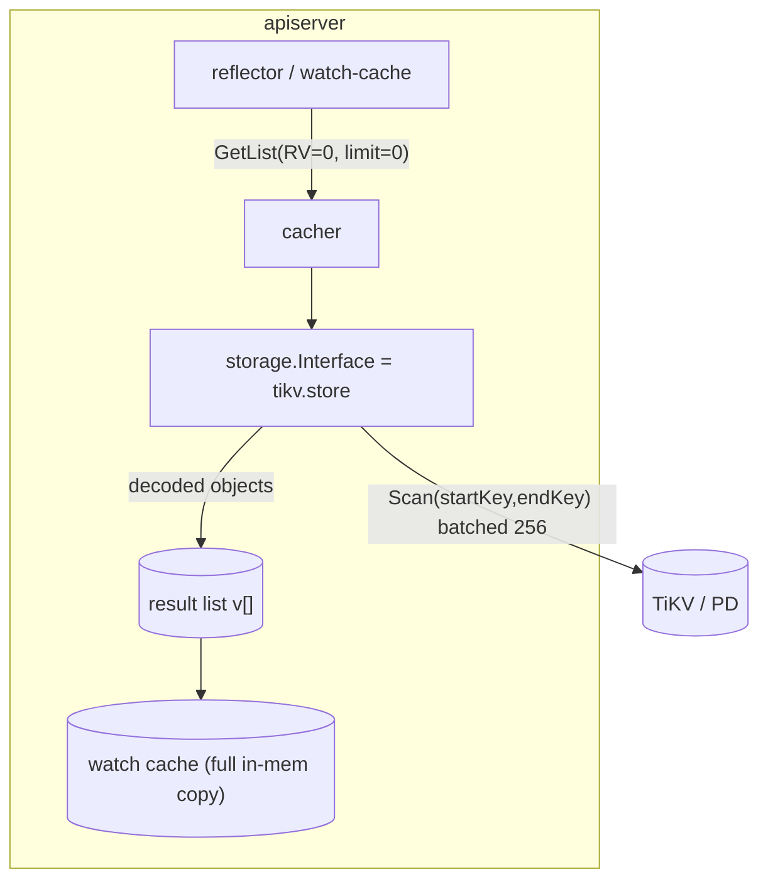

# TiKV LIST → kube-apiserver OOM: RCA & Fix Design

Status: Draft (implementation-ready)
Audience: An autonomous coding agent implementing changes in the **Kubernetes
fork** that builds `isletest.azurecr.io/kube-apiserver:tikv-dev`.
Companion to: [tikv-backend-perf-prd.md](tikv-backend-perf-prd.md) — this doc
drills into the single highest-severity item (R3: unpaginated relist) with
exact code locations and the corrected root cause.

> Scope: the kube-apiserver storage backend in the fork
> (`staging/src/k8s.io/apiserver/pkg/storage/tikv/`) and the cacher/reflector
> seeding path. NOT the AKS chart (that is hardening only and is done
> separately in `tikv-cluster.yaml`).

---

## 1. TL;DR

A perf test loaded **2001 ConfigMaps of ~1 MB each** (≈4.6 GB in TiKV). The
`kube-apiserver` **container** is then `OOMKilled` (exit 137) in a crash loop,
**while PD and TiKV stay perfectly healthy (0 restarts)**. The kill happens
during the **watch-cache relist**, where the apiserver lists *every* object of a
resource with **no limit** and materializes the entire decoded set in memory.

- etcd3 and the TiKV backend both **do** support paginated LIST (`limit` +
  `continue`).
- **Neither** paginates the watch-cache relist, because the cacher forces
  `limit = 0` for `ResourceVersion = "0"` lists by design.
- etcd survives this anyway because it **caps object size and total DB size**, so
  "everything" fits inside a production-sized apiserver. TiKV has **no such
  caps**, so "everything" is unbounded → apiserver OOM.
- TiKV's recent `GetList` fix bounded the **scan side** (per-RPC batch) but not
  the **result side** (the in-memory list it accumulates), so it does not help
  the `limit = 0` relist.

The fix is **not** "add pagination to GetList" (it's already there). It is:
(F1) enforce etcd-parity size limits, (F2) bound/stream the relist seed,
(F3) fail-safe instead of OOM, with (F4) apiserver memory sizing as a stopgap.

---

## 2. Incident context & evidence

Cluster: standalone CCP namespace `6a2828c1e0495e0001c92eb4`, kube-apiserver
running `--storage-backend=tikv` against PD (3) + TiKV (3).

Observed during/after the perf test:

| Signal | Evidence | Interpretation |
|--------|----------|----------------|
| apiserver termination | `lastState.terminated.reason=OOMKilled`, `exit=137` on multiple pods | cgroup OOM of the **kube-apiserver container** |
| apiserver live memory | `kube-apiserver` container at **7470Mi** then **8452Mi**, climbing to its limit | heap blowup toward the limit |
| storage layer | PD 3/3 and TiKV 3/3 **Running, 0 restarts** | **not** a storage-availability failure |
| load | `default` namespace = **2001 configmaps**; TiKV on-disk = **4.6 GB** | large dataset, large per-object payloads |
| pre-death logs | repeated `"Starting watch" path=…` | killed during **watch-cache initialization / relist** |
| limit churn | apiserver ReplicaSets at 3G/6G/9G; even **9G OOMs** | the demand scales with the dataset, not a fixed cap |

The earlier incarnation of this incident was a **TiKV** OOM cascade; that was
fixed by `tikv.toml` memory bounds (`memory-usage-limit`,
`grpc-memory-pool-quota`). Fixing TiKV **moved the bottleneck to the apiserver
container**, which is what this doc addresses.

---

## 3. How a LIST flows (two memory consumers)



Two places hold memory proportional to the dataset:

1. **The transient result list `v`** built inside `GetList` while decoding.
2. **The watch cache** itself, which by design holds a full in-memory copy of
   every object for the resource.

During seeding both exist simultaneously → roughly **2× the decoded dataset**.
With 2001 × ~1 MB objects (decoded/internal form is larger than on-disk), that is
multiple GB → exceeds the container limit → OOM.

---

## 4. Root cause (code-grounded)

### 4.1 The relist is intentionally unpaginated

`staging/src/k8s.io/apiserver/pkg/storage/cacher/cacher.go` → `computeListLimit`:

```go
// as of today, the limit is ignored for requests that set RV == 0
func computeListLimit(opts storage.ListOptions) int64 {
    if opts.Predicate.Limit <= 0 || opts.ResourceVersion == "0" {
        return 0
    }
    return opts.Predicate.Limit
}
```

`staging/src/k8s.io/client-go/tools/cache/reflector.go` (≈ line 601) also
**forces `pager.PageSize = 0`** when `ResourceVersion != "0"` so the list is
served from the watch cache rather than paged from storage:

```go
case options.ResourceVersion != "" && options.ResourceVersion != "0":
    // ... explicitly switch off pagination to force listing from watch cache ...
    pager.PageSize = 0
```

So the cache-seeding LIST reaches the storage backend with `Limit == 0`. This is
**identical for etcd3 and TiKV** — it is not a TiKV regression.

### 4.2 TiKV bounded the scan, not the result

`staging/src/k8s.io/apiserver/pkg/storage/tikv/store.go` → `GetList` (≈ line 530):

- **Scan side IS bounded** (good): a single pinned MVCC snapshot, and
  `snap.SetScanBatchSize(listScanBatchSize)` where
  `listScanBatchSize = envInt("KUBE_APISERVER_TIKV_LIST_BATCH_SIZE", 256)`. Each
  value is freed (`rawVal = nil`) as the iterator advances, so the **per-RPC
  transient** is one batch.
- **Result side is NOT bounded** (the bug): the loop only stops on a positive
  limit —

  ```go
  limit := int64(opts.Predicate.Limit)
  for iter.Valid() {
      if limit > 0 && count >= limit {   // never true when limit == 0
          break
      }
      ...
      if matched {
          v.Set(reflect.Append(v, reflect.ValueOf(obj).Elem())) // grows unbounded
          count++
      }
  }
  ```

  and the continue token is only emitted when `limit > 0`:

  ```go
  if limit > 0 && count >= limit && iter.Valid() && lastIterKey != nil {
      continueToken, _ := storage.EncodeContinue(...)
      return s.versioner.UpdateList(listObj, scanTS, continueToken, nil)
  }
  ```

So for the `limit == 0` relist, `SetScanBatchSize(256)` caps only the TiKV-side
buffer; the apiserver still appends **all 2001 decoded objects** into `v`. The
fix that batched the scan did not change the worst-case apiserver heap.

### 4.3 etcd3 does the same on `limit == 0` — the difference is the environment

`staging/src/k8s.io/apiserver/pkg/storage/etcd3/store.go` → `GetList` (≈ line 722)
also fills the result slice fully when `paging == false` (`limit == 0`). etcd
does not OOM the apiserver in practice because of **caps that bound "everything"**:

| Guardrail | etcd | TiKV (POC) |
|-----------|------|------------|
| Max object size | ~1.5 MB (`--max-request-bytes`/grpc) | **none** |
| Total keyspace size | 2–8 GB DB quota (`--quota-backend-bytes`) | **none** (4.6 GB stored) |
| Apiserver sized for dataset | yes | no (3 G limit on ~12.5 GB node) |
| Relist holds full set in `v` + cache | yes | yes |

The perf test wrote payloads etcd would have **rejected** (object too large) or
that would have hit the **DB quota**. TiKV accepted all of them, so the relist
set is unbounded.

### 4.4 Why `WatchList` doesn't save us here

`WatchList` (feature gate, Default **true** at v1.34 in this fork) streams the
**client → apiserver** initial list as watch events, reducing memory on that hop.
It does **not** change the **apiserver → storage** seeding: the apiserver's own
watch cache is still filled by `GetList(RV=0, limit=0)` against TiKV. So enabling
`WatchList` alone does not fix the container OOM.

---

## 5. Suggested fixes (prioritized, implementable)

### F1 — Enforce etcd-parity size limits in the TiKV backend (MUST)

Bound the worst case at the source so the relisted set can fit a sized apiserver.

- **Max object size on write.** In `tikv/store.go` `Create` (≈ line 214) and the
  update path in `GuaranteedUpdate`, reject objects whose serialized size exceeds
  a configurable cap (default parity with etcd, ~1.5 MiB):
  `KUBE_APISERVER_TIKV_MAX_OBJECT_BYTES` (default `1572864`). Return
  `storage.NewInternalError` / an `apierrors.NewRequestEntityTooLargeError`-style
  error so clients get a clean 413 instead of silently storing a payload that
  later OOMs every relist.
- **Total-size visibility.** Export a gauge of approximate total bytes per
  resource prefix (you already accumulate `scannedBytes` in `GetList`) so the
  keyspace growth that precedes an OOM is observable/alertable.

Acceptance:
- Writing a 5 MiB ConfigMap returns 413 (configurable), and is **not** persisted.
- With the cap in place, a relist of a resource cannot exceed
  `maxObjectBytes × count`, which ops can size against.

### F2 — Bound / stream the watch-cache relist seed (SHOULD)

Remove the transient **2×** and give a hard ceiling on the seed.

- **Internally page the `limit == 0` relist.** In `tikv/store.go` `GetList`,
  when `limit == 0`, still iterate in `listScanBatchSize` chunks **and**
  periodically hand decoded items to the caller instead of growing `v`
  unbounded. Concretely, drive the seed through the existing snapshot + continue
  mechanism (it already produces a snapshot-pinned `scanTS` and a continue
  token); reuse it for `limit == 0` by applying an **internal page size**
  (`KUBE_APISERVER_TIKV_LIST_INTERNAL_PAGE`, default 1000) so the loop yields and
  frees each page. This is the spirit of PRD **R3**.
- **Prefer streamed seeding where available.** Where the cacher supports
  incremental seeding (`ListFromCacheSnapshot` / `SendInitialEvents`
  machinery), feed items as a stream rather than building one giant list, so the
  steady-state cache copy is the only full-size allocation (not cache + `v`).

Acceptance (primary incident metric, from the PRD):
- Relist of **5000 × ~1 MiB** objects: apiserver container peak RSS **< 2 GiB**
  (3 G limit), each TiKV pod **< 4 GiB**, **zero** OOMs, p99 internal page
  latency **< 500 ms**.
- With `--watch-cache=true` (default), apiserver startup relist completes and the
  pod reaches `Ready` on a ~12.5 GiB node.

### F3 — Fail safe instead of OOM (SHOULD)

A wedged cluster must stay recoverable.

- **Backend memory guard.** In `GetList`, track `accumulatedBytes` and, if it
  exceeds a configurable ceiling (`KUBE_APISERVER_TIKV_LIST_MAX_BYTES`, default
  e.g. 1 GiB) for an unpaginated list, abort with
  `storage.NewTooLargeResourceVersionError`-style guidance / a retriable error
  rather than letting the process OOM. A failed LIST is recoverable; a crash loop
  that prevents deleting the offending data is not.
- This directly fixes the "can't self-heal" trap observed in the incident
  (apiserver OOMs before it can serve the deletes that would shrink the data).

Acceptance:
- A pathological unpaginated LIST over a multi-GB resource returns an error and
  the apiserver **stays up**; an operator can then page/delete to recover.

### F4 — Apiserver memory sizing (stopgap, ops-only)

Until F1–F3 land, size the `kube-apiserver` container memory limit to the
expected dataset. This is what the temporary 9 G patch did. Keep the limit
**below node allocatable** so a kill is a clean per-container OOM, not a node OOM.
This is a mitigation, not a fix.

---

## 6. Test plan

1. **Unit (in `storage/tikv/store_test.go`)**
   - `GetList` with `limit == 0` over N synthetic objects asserts the result is
     produced in bounded transient memory (drive F2's internal paging; assert the
     number of scan batches == ⌈N / internalPage⌉).
   - F1: `Create`/`GuaranteedUpdate` reject an over-cap object with the expected
     error and persist nothing.
   - F3: an unpaginated list past the byte ceiling returns the retriable error.
2. **Memory bound test** — write N large objects, run a full relist, assert
   process RSS delta stays below threshold (`runtime.ReadMemStats` / max RSS).
3. **Integration (standalone)** — rebuild `tikv-dev`, load 5000 × ~1 MiB
   ConfigMaps, then: (a) rollout-restart the apiserver and (b) `kubectl get
   configmaps`; assert the §5 F2 acceptance metrics via cgroup `memory.peak` on
   the apiserver and TiKV pods. Verify the cluster stays serviceable (no crash
   loop) and the data is deletable.
4. **Regression gate** — wire the unit + memory tests into the fork CI for the
   `tikv` package.

---

## 7. Acceptance summary (single source of truth)

| ID | Fix | Pass condition |
|----|-----|----------------|
| F1 | etcd-parity size caps | over-cap write → 413, not persisted; total-bytes gauge emitted |
| F2 | bounded/streamed relist | 5000×1 MiB relist: apiserver < 2 GiB, TiKV < 4 GiB/pod, 0 OOM, p99 page < 500 ms |
| F3 | fail-safe on huge list | pathological unpaginated LIST errors out; apiserver stays up |
| F4 | apiserver sizing (ops) | container limit ≥ expected dataset and < node allocatable |

---

## 8. Key file references (fork)

- `staging/src/k8s.io/apiserver/pkg/storage/tikv/store.go` — `GetList` (≈530),
  `Create` (≈214), `listScanBatchSize` (≈68), continue-token emit (≈697)
- `staging/src/k8s.io/apiserver/pkg/storage/etcd3/store.go` — reference `GetList`
  (≈722), continue/paging semantics
- `staging/src/k8s.io/apiserver/pkg/storage/cacher/cacher.go` — `computeListLimit`
  (≈689)
- `staging/src/k8s.io/client-go/tools/cache/reflector.go` — `pager.PageSize = 0`
  for RV≠0 (≈601)
- `staging/src/k8s.io/apiserver/pkg/features/kube_features.go` — `WatchList`,
  `ListFromCacheSnapshot`, `ConsistentListFromCache`
